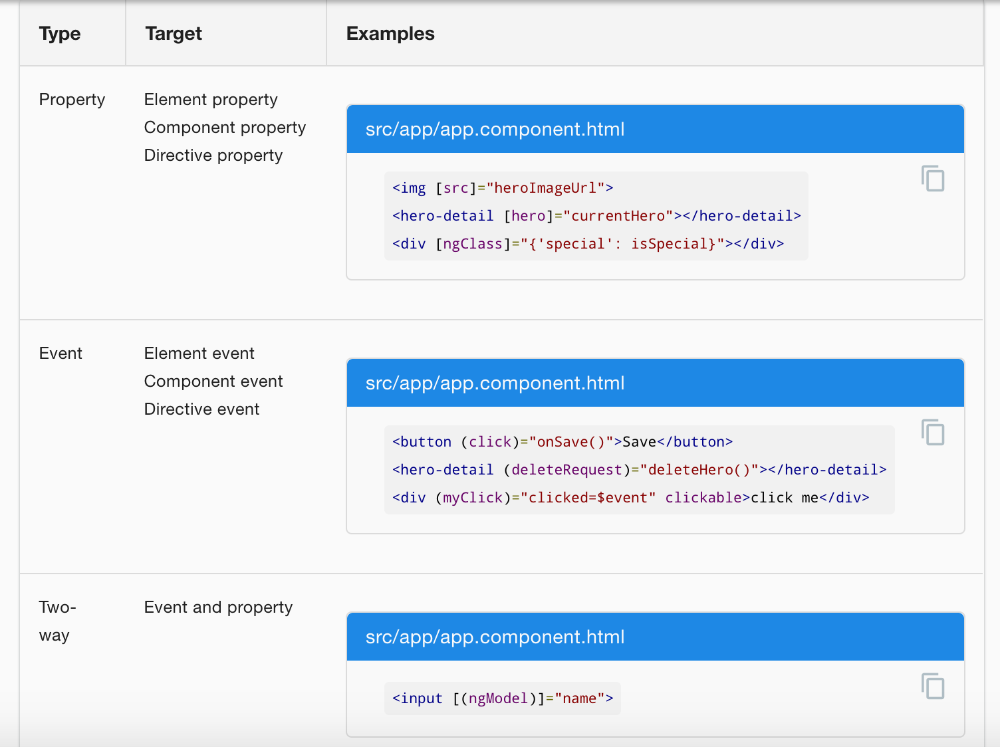

[](https://generalassemb.ly/education/web-development-immersive)

# Summary

Angular is a front-end framework developed and maintained by Google.

### [Angular CLI](https://cli.angular.io/)
The Angular command line interface (CLI) is a tool that allows us to serve up our Angular app, run tests, and generate code. We can use it to quickly spin up new applications to work from!

- Creating a new app:
```bash
ng new myApp
```

- Creating a new component:
```bash
ng generate component myComponent
ng g c myComponent
```

- Running the app locally:
```bash
ng serve
```


### [Components](https://docs.angularjs.org/guide/component)
One of those parts was a **component**, which we explored in great detail. Components are pieces of our application that we can define once and reuse all over the place.
- Take a look at [Wolfram Alpha](https://www.wolframalpha.com/) - each explore link is a component.


### [Directives](https://angular.io/guide/structural-directives)

A **directive** is a marker on a DOM element (such as an attribute, element name, comment or CSS class) that tells Angular to attach a specified behavior to that DOM element (e.g. via event listeners like `click` or `change`), or even to transform the DOM element and its children.

> **TLDR:** It is a piece of HTML that allows you to do Javascript things.

There are three types of directives:
- Component directives are generally thought of as separate from directives, so we won't go into that.
- Attribute directives change the appearance or behavior of an existing element.
  - For example, here is an attribute directive called `ngModel` that changes what hero name is displayed on a button: `<input [(ngModel)]="hero.name">`
- Structural directives change which elements are in the DOM (adding or removing them).
  - For example, here is a structural directive called `*ngFor`: `<li *ngFor="let hero of heroes"></li>`.
  - In this example, `ngFor` tells Angular to print one `<li>` per `hero` in the `heroes` list (a `for` loop, running through `heroes` with `let... of ...`).


### [Modules](https://docs.angularjs.org/guide/module)
We can package our components in modules. Modules are containers for the different parts of your app – services, directives, etc - and make it easy for those parts to be reused.


### [Services](https://docs.angularjs.org/guide/services)
We can move code - like business logic - to services. Services, like components, help us keep break up pieces of code that do different things, so that everything in Angular is easily reusable.
- This keeps our code DRY (don't repeat yourself!).
- You can keep what should be displayed on the screen - the view - in the component, and the script that needs to be run in the service.

- Here's a service that simply does a return, but later we'll make it much more complicated!
```js
getUsername(): string {
  return 'Link';
}
```
- In the component itself, we simply call the service.

```javascript
ngOnInit() {
  //And then initialize proclamation AND a username
  this.proclamation = `Behold! ${this.userService.getUsername()}'s Master Sword!`;
}
```


### [TypeScript](http://www.typescriptlang.org/docs/home.html)
We started by learning about **TypeScript** and how it differs from regular JavaScript. Typescript was created to "statically identify constructs that are likely to be errors."

- Here, we declare that `clearTextPassword` must be a `boolean`.

```js
// Written with TypeScript
function getPassword(clearTextPassword: boolean) : string {
    if(clearTextPassword) {
        return 'password';
    }
    return '********';
}

let password = getPassword('false'); // throws: error TS2345: Argument of type "false" is not assignable to parameter of type 'boolean'.
```


## Overall Flow of an Application

The basic files in Angular are:
- `app.component.html`
  - This is where you define what will appear on the screen. For example:
  ```html
  <h1>
    Welcome to {{title}}!
  </h1>
  ```

- `app.component.ts`
  - This is where you define the logic for your app - where you write all your TypeScript. For example,
  ```js
  export class AppComponent {
    title = 'app';
    everySecond() { console.log('another second'); }
  }
  ```

- `app.module.ts`
  - This is what ties your application together. For example:
  ```js
  @NgModule({  // This defines the module
    declarations: [ // This lists the components in your application. Each time you make a new component, you add it here
      AppComponent
    ],
    imports: [  // This defines libraries that your components depend on. We have a form on the screen, so we need the forms library from Angular.
      BrowserModule,
      FormsModule
    ],
    providers: [], // We'll go over this in a later lesson!
    bootstrap: [AppComponent] // This ties the whole component together, saying "Here is everything for this component"
  })
  export class AppModule { } // This makes your component available for other files to use (like displaying it in `index.html`)
  ```

>**Note:** Every new component you make will come with its own `component.html` and `.component.ts` file. You can make more files when you need them, like if you make a service.

## Angular Punctuation

We've seen a lot of Angular punctuation today.  Here is a quick review of what they all mean:




Sometimes, we will see properties without the `[]`s around them.  What does that mean?  

If we have `[]`, we will evaluate the expression in Javascript.  If we don't, we will simply see the property as a string.  For example:


## Advice and Words of Encouragement

You now have all the knowledge you need to build a simple Angular application from scratch!

- Progressing from step-by-step instructions to "Build me the Uber of Popcorn."
- `console.log()` all the things!
  - Not sure if you're on the back end or front end?  `console.log()`
  - Not sure what that variable is? `console.log()`
  - Is this an object or an array?  `console.log()`
  - ....
- Retreading old material is key.
  - Everyone forgets things! Don't be shy about looking at old lessons or projects.
- Lately, the only difficulty is passing a thing from one place to the next.
  - This is basically web development in a nutshell.
- If you're lost, research!
  - Time to start looking for documentation and tutorials.
- You are building full-stack apps!

- A great resource is the [Angular Cheat Sheet](https://angular.io/guide/cheatsheet).
